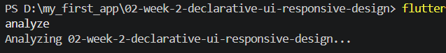

## Verification Checklist

- flutter analyze produces no errors.

- flutter test passes all responsive widget tests.

- The application runs at narrow and wide screen sizes.

- Dark mode has sufficient contrast and readable text.

- The widget structure can be explained during code review.

- Screenshots, the test/ folder, and README are stored in the Week 2 assignment folder.

## REFLECTION

1. How does imperative thinking differ from declarative thinking when building UI?

- Imperative change UI manually step by step through mutation while declarative design shape of UI base that state.

2. When does Expanded help, and when can it cause a layout error?

- Expanded fill in the empty room and prevent overflow. Other case, get errorwhen put in the container without size limit.

3. How do breakpoints and themes affect user experience?

- Breakpoints maintaining interface still proportional and comfortable use in many size screen. Themes give comfort visual and maintaining color consistency.

4. What did you verify after receiving an AI design recommendation?

- Ensure that syntax not out date / deprecated and not crack the logial inside. Also test the boundry screen to not overflow and chechk the