## Alb 3 - Test all three states

1. Copy the code above into your ToDo project (or a separate project) and run it. Observe the loading screen for the first 2 seconds.

2. Temporarily change build() to throw an error: throw Exception('Failed to connect to the server');. Run and observe the error screen with its Retry button.

Trying flutter run with changing to throw Exception..... make the display into like the image above but also the loading is more than 2 seconds.

3. Press Retry ref.invalidate re-runs the provider. Restore the code and confirm the success state is shown.

- After restore throw Exception(...) into return [...], retry button not directly show the data. Apps still in the same error state. After i running the apps and run it again (flutter run), provider success load data and display the list product. Show that provider success entry to the data state after restore the normal state code.

4. Reflect: why is showing stale data with a refresh indicator sometimes better than blanking the screen? When is that pattern important?

- Showing stale data with a refresh indicator provides a smoother user experience because users can continue viewing existing information while new data is loaded. It prevents screen flickering, preserves context, and remains useful even when refresh operations fail. This pattern is especially important in applications such as email clients, social media feeds, e-commerce apps, and dashboards where displaying older data is better than showing an empty loading screen.

## AI CHALLANGE

# AI Verification Checklist

1. Is state mutated immutably (no state.add() or direct list mutation)?

- Yes, state is mutated immutably. by creates a brand new list and then spreads the previous state into a fresh list and replace with a new copy using copyWith. Continue with create a shallow clone first via list spread and mutates the new clone before assigning it to state but the original list reference is never directly mutated.

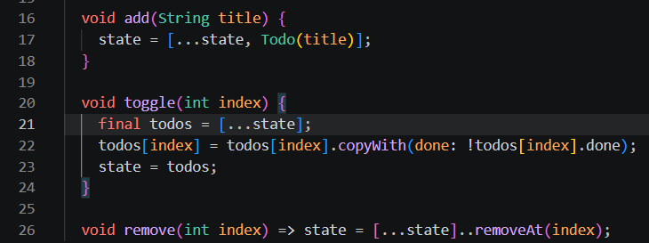

2. Is ref.watch used only inside build, and ref.read inside callbacks?

- Yes, ref.watch us used only inside build and ref.read is used inside callbacks

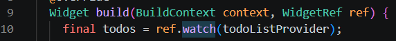

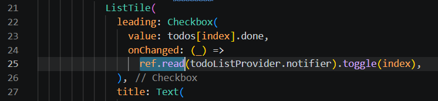

3. Are all three AsyncValue states really handled (not only success)?

- Yes, all three AsyncValue states are really handled.

4. Is the provider declared with an explicit type and not duplicated with other providers?
Does the AI code use old Riverpod APIs (StateProvider antipattern, deprecated StateNotifierProvider, or unnecessary nested Consumer)? Fix them to use the Notifier/ConsumerWidget pattern.

- Yes, both providers are explicitly typed with their class and state generic arguments, also not duplicated.

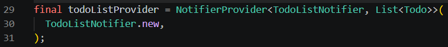

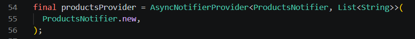

- No, the code is not using old Riverpod APIs 

5. Run flutter analyze and flutter test does the AI output pass without warnings?

- Even using AI, there's still warning.

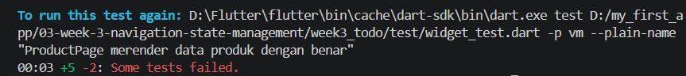

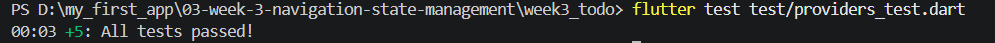

# Self-Verification Checklist

flutter analyze

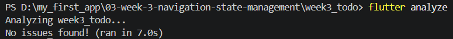

flutter test

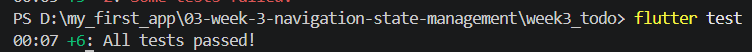

- GoRouter navigation works: navigating pages, going back, and accessing the detail path directly.

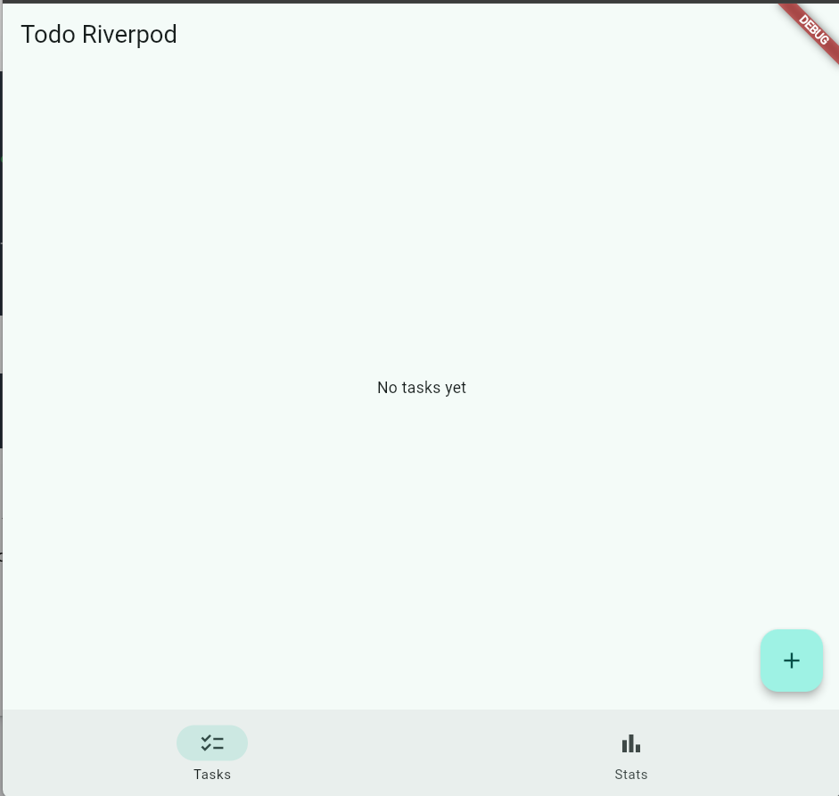
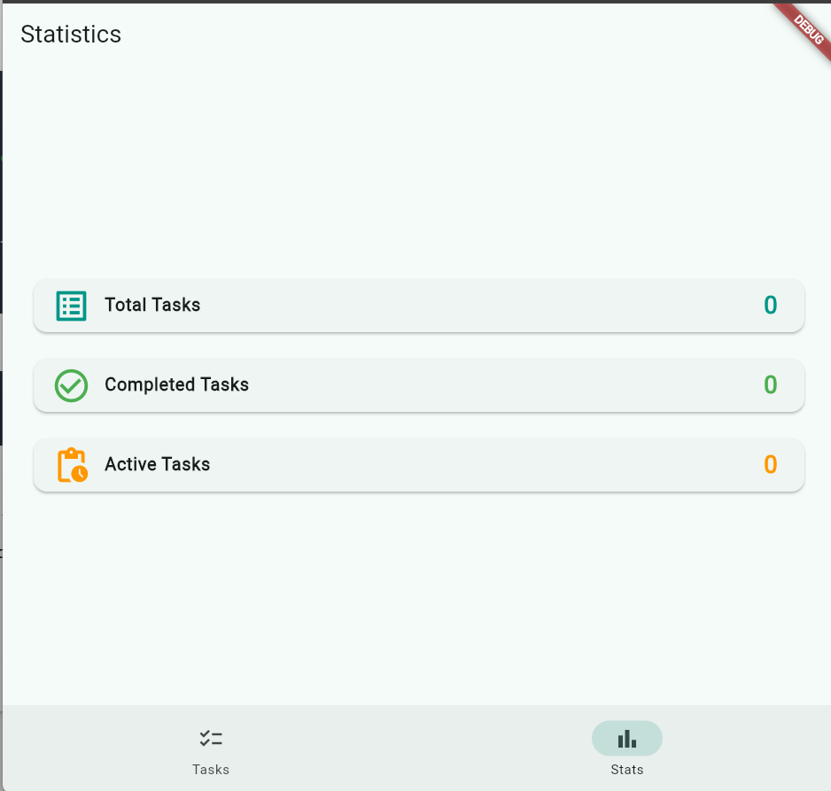

- ProviderScope wraps the application root; ToDo state survives when switching pages.

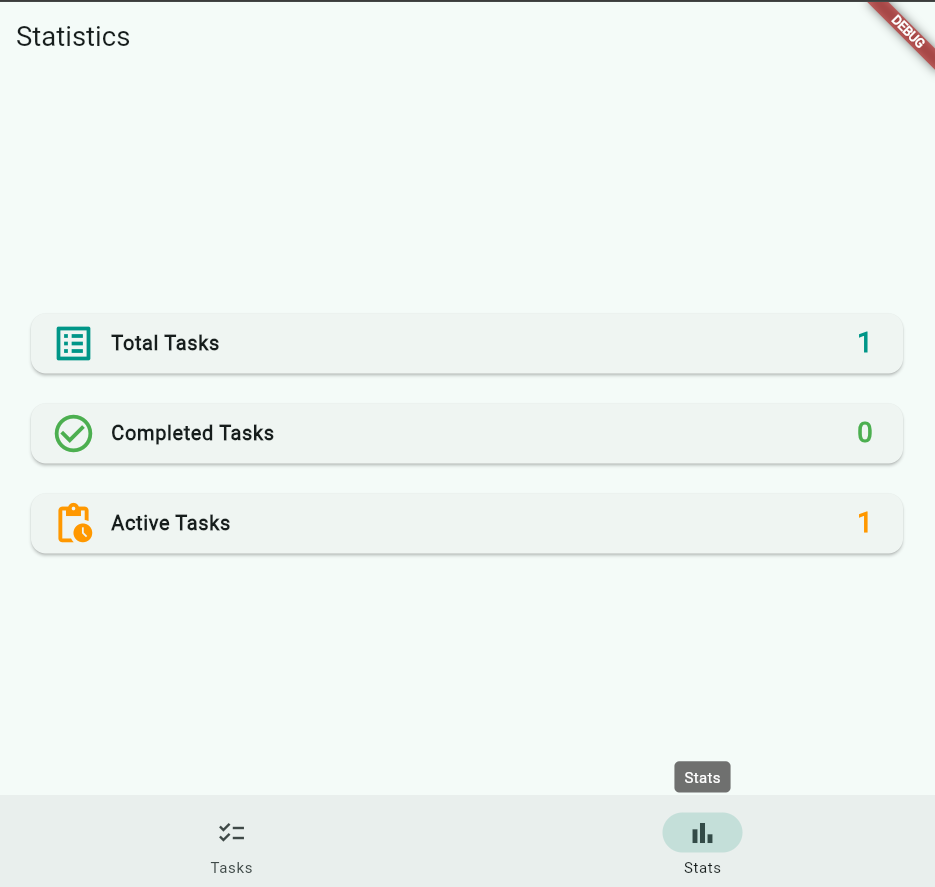
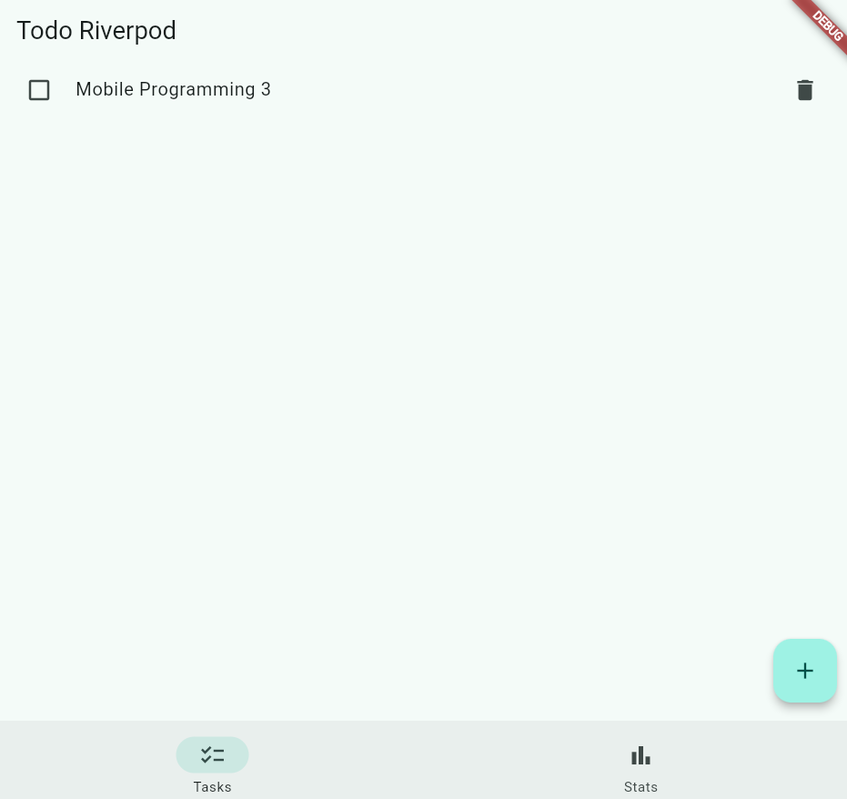

- The AsyncValue UI handles loading, error, and success, not only success.

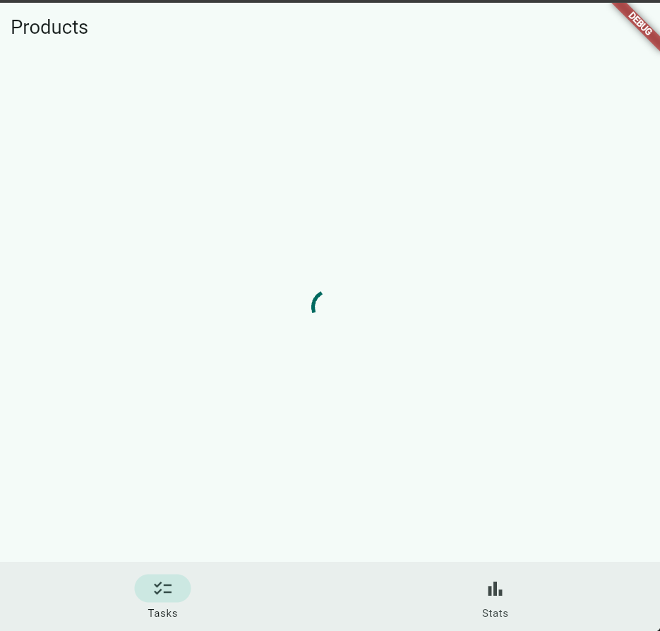
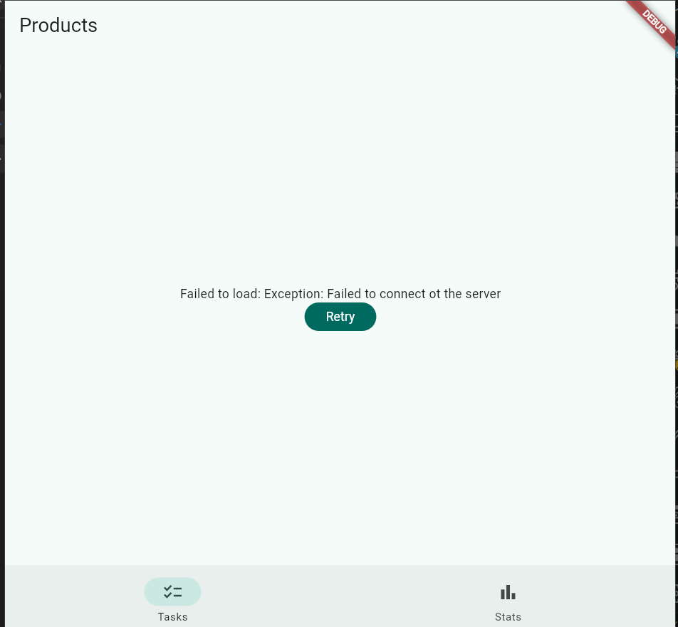

# Reflection
1. When is setState still enough, and when should state be lifted into Riverpod?

- `setState` is suitable for short-lived local state that affects only a single widget, such as managing a `TextEditingController` within an input dialog. In contrast, state should be lifted to Riverpod if the data needs to be shared across multiple pages or must persist in memory when navigating between routes.

2. What is the difference between context.go and context.push, and when should each be used?

- `context.go` declaratively replaces the entire route stack based on the destination URL, whereas `context.push` stacks a new page onto the navigation stack while preserving the history of previous screens. Therefore, use `context.go` for primary navigation tab switches—such as those involving a `NavigationBar`—and use `context.push` to open detail pages that require a "back" button.

3. How does AsyncValue prevent bugs compared with three separate booleans?

- AsyncValue prevents impossible data states—such as simultaneous loading and error conditions—because the states are mutually exclusive. Furthermore, the .when() method enforces the handling of all state branches (loading, error, and data) at compile time, ensuring there are no unhandled scenarios that could result in a blank screen.

4. Which part of the AI output did you fix, and why?

- Improvements were made by separating the page and the provider—originally combined in a single file—into their own independent files to ensure a clean code structure and facilitate importing. Additionally, the cleanup of the `TextEditingController` within the dialog was improved by adding `controller.clear()`, preventing widget tests from detecting duplicate text during the dialog's closing animation.