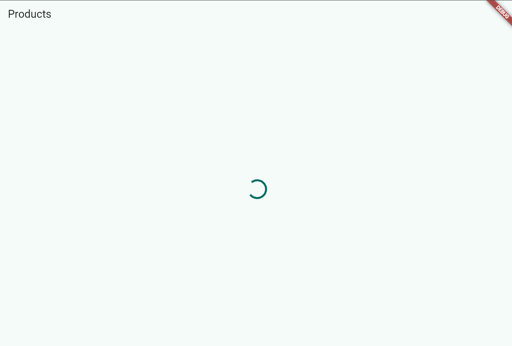
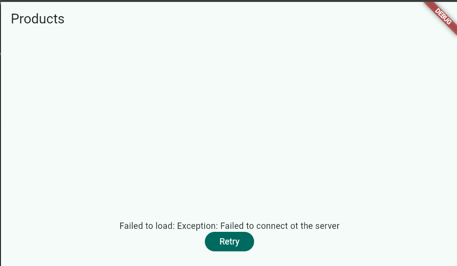

## Alb 3 - Test all three states

1. Copy the code above into your ToDo project (or a separate project) and run it. Observe the loading screen for the first 2 seconds.

2. Temporarily change build() to throw an error: throw Exception('Failed to connect to the server');. Run and observe the error screen with its Retry button.

Trying flutter run with changing to throw Exception..... make the display into like the image above but also the loading is more than 2 seconds.

3. Press Retry ref.invalidate re-runs the provider. Restore the code and confirm the success state is shown.

- After restore throw Exception(...) into return [...], retry button not directly show the data. Apps still in the same error state. After i running the apps and run it again (flutter run), provider success load data and display the list product. Show that provider success entry to the data state after restore the normal state code.

4. Reflect: why is showing stale data with a refresh indicator sometimes better than blanking the screen? When is that pattern important?

- Showing stale data with a refresh indicator provides a smoother user experience because users can continue viewing existing information while new data is loaded. It prevents screen flickering, preserves context, and remains useful even when refresh operations fail. This pattern is especially important in applications such as email clients, social media feeds, e-commerce apps, and dashboards where displaying older data is better than showing an empty loading screen.

## AI CHALLANGE

# AI Verification Checklist

