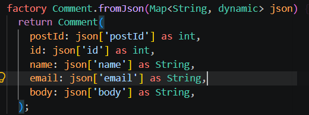
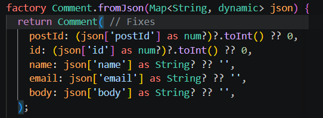
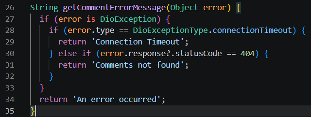
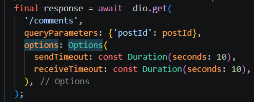
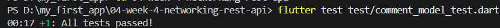
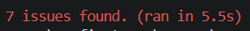
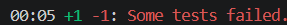

# LAB 2 : PROVIDER AND ERROR HANDLING

## Test three error scenarios

1. Run the app with normal internet, observe loading, then the list of 100 posts.

2. Turn off the internet (airplane mode), press refresh, observe the friendly message + Retry button. Turn the internet back on, press Retry.

No Internet Connection

After Connect to the internet and press Retry 

3. Temporarily change baseUrl to a wrong URL, observe the connection error message. Restore it after the test.

Change baseURL to wrong URL

# Lab 3: Basic Pagination

Observe:

Page 1 appears with ten lists also include loading indicator

Data grows without a full reload

# AI Challenge

## AI Verification Checklist

1. Does the UI call Dio directly (forbidden) or go through the repository?

- Base on Code that AI generate, not call Dio directly within the UI layer.

2. Is fromJson null-safe, or does it still use direct casts that can crash?

- Base on code that AI generate, yes still use direct casts that can crash. The initial AI code used rigid direct casts such as json['postId'] as int and json['name'] as String. If the API returns null, missing fields, or floating-point numbers (e.g., 1.0), the application will immediately crash due to a type cast error

Initial AI : 

Fixes code: 

3. Are all DioExceptionType values (timeout, connectionError, badResponse) mapped to user messages?

- Base on the AI code, the initial AI error handler only checked for connectionTimeout and 404 status codes. 

Initial AI: 

Fixes: 

4. Are baseUrl/timeouts centralized in one client instead of scattered across methods?

- Scattered across methods. The AI hardcoded Options(sendTimeout: ...) locally inside the fetchComments() method within CommentRepository

Initial AI:

Fixes: 

5. Does the AI test really cover the missing-field case, or only the happy path? Add at least 1 edge case of your own.

- Only the happy path, AI only tested comple JSON structures

Initial AI: 

6. Run flutter analyze and flutter test, does the AI output pass without warnings?

- Absolutely not pass

Flutter 

# Reflection

1. Why is the UI forbidden from calling Dio directly? What breaks if this rule is violated?

- The UI is forbidden from calling Dio directly to keep the architecture clean (separation of concerns) and make interface components easy to test without depending on the API. If violated, code flow becomes messy, difficult to maintain, and unit testing UI components becomes extremely hard to execute.

2. When is client-side pagination enough, and when must you rely on server pagination (_page/_limit)?

- Client-side pagination is sufficient when the total data is small and can be safely loaded all at once initially. Conversely, server pagination (_page/_limit) is required when handling large or continuously growing datasets to save network bandwidth and device memory.

3. How do repository exceptions become AsyncError without try/catch in every widget? When is explicit try/catch still needed?

- Exceptions from the repository are automatically caught by Riverpod's AsyncNotifier and converted into AsyncError when called inside the build() method. Explicit try/catch blocks are still needed in user action methods (event handlers) like refresh buttons or form submissions to manage UI state manually.

4. Which part of the AI output did you fix, and why?

- The fixed portion was the scroll trigger logic, changing it from a fixed pixel threshold (maxScrollExtent - 200) to a position-percentage approach (NotificationListener). This was done because a fixed pixel threshold often fails to detect scrolling on high-resolution emulators when the item count is low.
