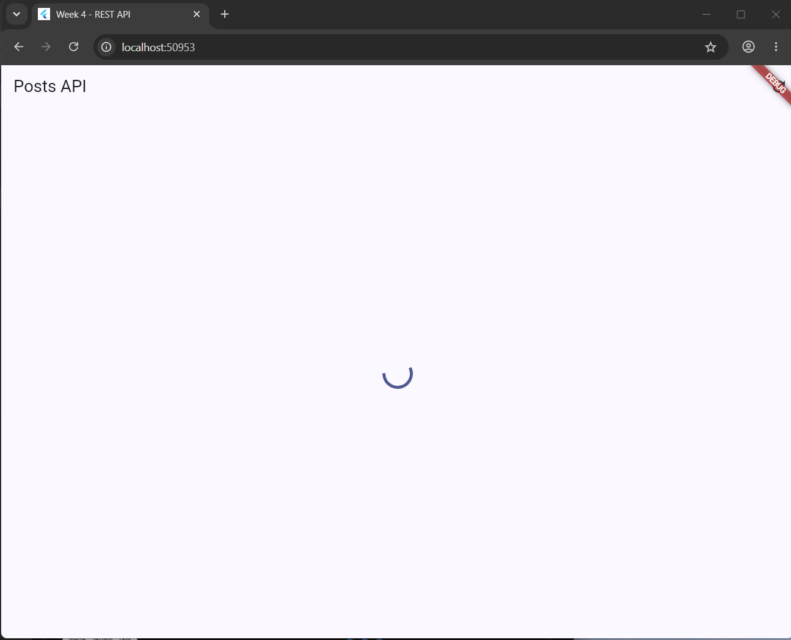
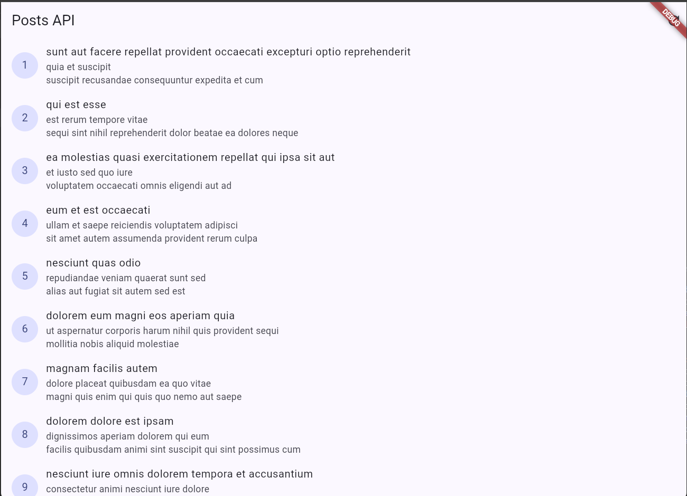
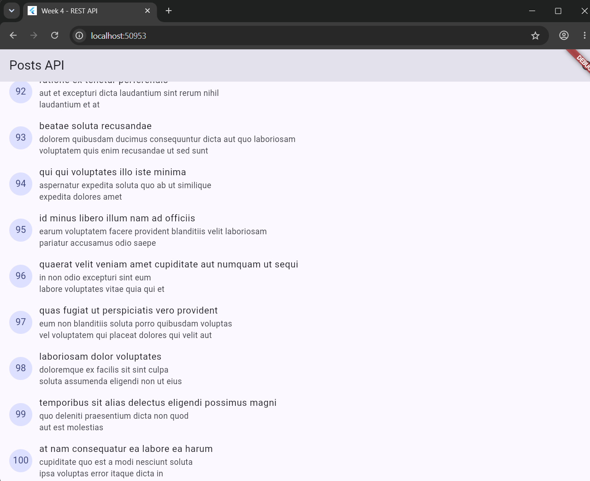
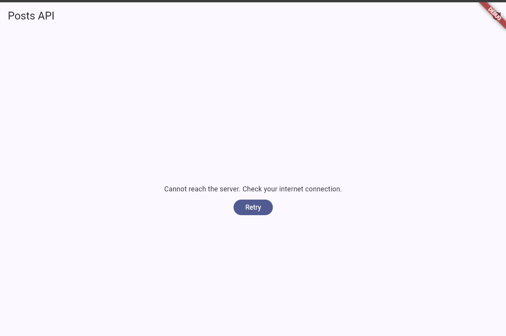
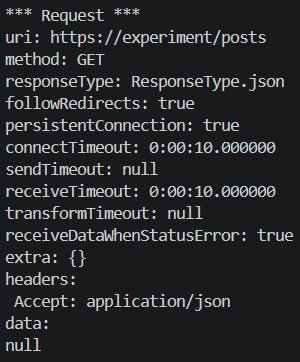
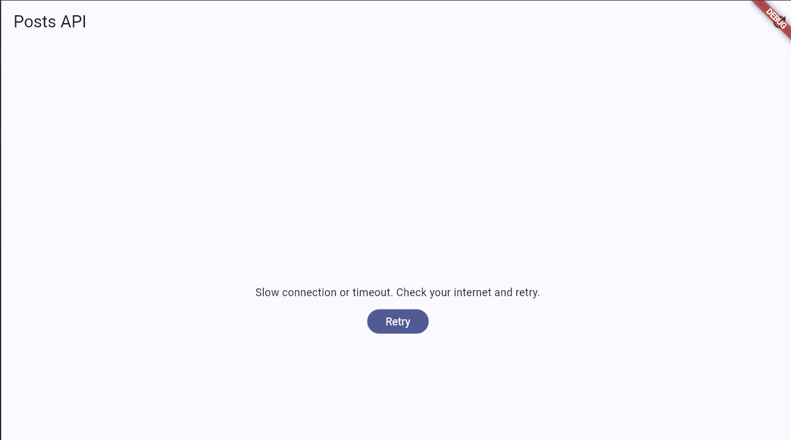

# LAB 2 : PROVIDER AND ERROR HANDLING

## Test three error scenarios

1. Run the app with normal internet, observe loading, then the list of 100 posts.

2. Turn off the internet (airplane mode), press refresh, observe the friendly message + Retry button. Turn the internet back on, press Retry.

No Internet Connection

After Connect to the internet and press Retry 

3. Temporarily change baseUrl to a wrong URL, observe the connection error message. Restore it after the test.

Change baseURL to wrong URL

